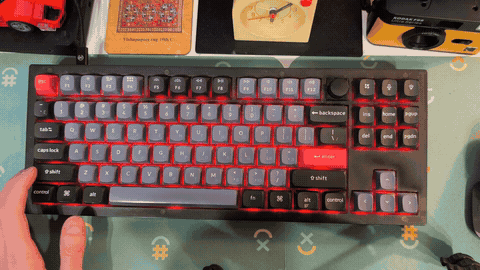
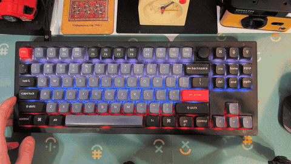

# kolor-keyboard: Индикация раскладки через RGB

Утилита на Go для индикации раскладки клавиатуры через RGB подсветку.

<p align="center">
  
  
</p>
<p align="center">
  <b>Mono</b> — глобальный цвет &nbsp;&nbsp;&nbsp;&nbsp;&nbsp;&nbsp;&nbsp;&nbsp;
  <b>Draw</b> — per-key RGB (флаги, рисунки)
</p>

> ⚠️ **Дисклеймер**
>
> Этот проект полностью сгенерирован с помощью [Claude Code](https://claude.com/claude-code).
> Использование на свой страх и риск. Автор проекта не несёт ответственности за любые
> последствия, включая возможные проблемы с вашим аппаратным или программным обеспечением.

## Поддерживаемые клавиатуры

| Клавиатура | Раскладка | Энкодер | Статус |
|------------|-----------|---------|--------|
| Keychron V3 | ANSI | ✅ | Протестировано |

## Поддерживаемые платформы

| ОС | DE | Статус |
|----|-----|--------|
| Linux | KDE Plasma 6 | Протестировано (openSUSE Tumbleweed) |
| Linux | KDE Plasma 5 | Должно работать |
| Linux | GNOME, Sway и др. | Не поддерживается (планируется) |

## Поддерживаемые прошивки

| Прошивка | Режим Mono | Режим Draw |
|----------|------------|------------|
| **Stock** (QMK/VIA) | ✅ | ❌ |
| **Vial** | ✅ | ✅ |

### Режимы работы:
- **Mono** — глобальный цвет для всей клавиатуры
- **Draw** — per-key RGB для отрисовки флагов стран (только Vial)

---

## Что работает

- Отслеживание смены раскладки через KDE D-Bus
- **Stock прошивка**: изменение глобального цвета через VIA RGB Matrix протокол
- **Vial прошивка**: per-key RGB управление для отрисовки флагов + mono режим
- Конфигурация цветов/флагов для разных раскладок

## Структура проекта

```
kolor-keyboard/
├── cmd/kolor-keyboard/main.go           # Точка входа
├── internal/
│   ├── config/
│   │   ├── config.go              # Загрузка конфига
│   │   └── types.go               # Типы конфигурации
│   ├── dbus/
│   │   └── keyboard.go            # KDE D-Bus watcher
│   ├── hid/
│   │   ├── device.go              # HID устройство
│   │   └── protocol.go            # VIA/Vial RGB протокол
│   └── app/app.go                 # Главное приложение
├── configs/
│   ├── keychron_v3_stock_mono.yaml  # Stock прошивка: глобальный цвет
│   ├── keychron_v3_vial_mono.yaml   # Vial прошивка: глобальный цвет
│   └── keychron_v3_vial_flags.yaml  # Vial прошивка: флаги стран
├── docs/
│   └── FIRMWARE.md                # Инструкция по прошивке Vial
├── scripts/
│   └── kolor-keyboard.service           # systemd unit
├── go.mod
└── Makefile
```

## Использование

```bash
# Сборка
go build -o kolor-keyboard ./cmd/kolor-keyboard

# Stock прошивка: глобальный цвет
./kolor-keyboard -config configs/keychron_v3_stock_mono.yaml

# Vial прошивка: глобальный цвет
./kolor-keyboard -config configs/keychron_v3_vial_mono.yaml

# Vial прошивка: флаги стран (per-key RGB)
./kolor-keyboard -config configs/keychron_v3_vial_flags.yaml

# С отладкой
./kolor-keyboard -debug -config configs/keychron_v3_vial_flags.yaml
```

## Конфигурация

### Поля конфигурации

| Поле | Значения | Описание |
|------|----------|----------|
| `firmware` | `stock`, `vial` | Тип прошивки (по умолчанию: `vial`) |
| `mode` | `mono`, `draw` | Режим работы (по умолчанию: `mono`) |

### Stock + Mono (глобальный цвет, стоковая прошивка)

```yaml
device:
  vendor_id: 0x3434
  product_id: 0x0331
  usage_page: 0xFF60
  usage: 0x61

firmware: stock
mode: mono

colors:
  - layout: ru
    color: {r: 255, g: 0, b: 0}    # Красный
  - layout: us
    color: {r: 0, g: 0, b: 255}    # Синий
  - layout: "*"
    color: {r: 255, g: 255, b: 255} # Белый (fallback)
```

### Vial + Draw (per-key RGB флаги, прошивка Vial)

```yaml
device:
  vendor_id: 0x3434
  product_id: 0x0331
  usage_page: 0xFF60
  usage: 0x61

firmware: vial
mode: draw

keyboard:
  rows:
    - [0, 1, 2, 3, 4, 5, 6, 7, 8, 9, 10, 11, 12, 13, 14, 15]           # Row 0
    - [16, 17, 18, 19, 20, 21, 22, 23, 24, 25, 26, 27, 28, 29, 30, 31, 32]  # Row 1
    # ... остальные ряды (см. docs/LED_MAP.md)

draw:
  # Флаг России: Белый / Синий / Красный (горизонтальные полосы)
  - layout: ru
    stripes:
      - rows: [0, 1]
        color: {r: 255, g: 255, b: 255}  # Белый
      - rows: [2, 3]
        color: {r: 0, g: 50, b: 255}     # Синий
      - rows: [4, 5]
        color: {r: 255, g: 0, b: 0}      # Красный

  # Флаг США: синий canton + красно-белые полосы
  - layout: us
    stripes:
      # Синий canton (левый верхний угол)
      - leds: [0, 1, 2, 3, 4, 5, 6]      # ESC, F1-F6
        color: {r: 0, g: 50, b: 180}
      - leds: [16, 17, 18, 19, 20, 21, 22]  # ~, 1-6
        color: {r: 0, g: 50, b: 180}
      # ... (белые и красные полосы)
```

## Зависимости

- `github.com/godbus/dbus/v5` — D-Bus для KDE
- `github.com/sstallion/go-hid` — HID устройства (требует CGO)
- `gopkg.in/yaml.v3` — конфигурация

### Для сборки

```bash
# openSUSE
sudo zypper install systemd-devel

# Debian/Ubuntu
sudo apt install libudev-dev
```

## Протоколы

### VIA RGB Matrix (глобальный цвет)

```
# Set effect (2 = solid color)
0x07, 0x03, 0x02, effect

# Set color (hue, saturation)
0x07, 0x03, 0x04, hue, sat
```

### Vial RGB (per-key RGB)

Требует прошивку Vial! См. [docs/FIRMWARE.md](docs/FIRMWARE.md)

```
# Enable Direct Control mode (effect 1)
0x07, 0x03, 0x02, 0x01

# Set LEDs directly
0x07, 0x42, start_lo, start_hi, count, H, S, V, ...

# Get LED count
0x08, 0x43
```

## Установка как systemd service

```bash
# Скопировать бинарник
sudo cp kolor-keyboard /usr/local/bin/

# Скопировать конфиг (выберите подходящий для вашей прошивки)
mkdir -p ~/.config/kolor-keyboard

# Для Stock прошивки (глобальный цвет):
cp configs/keychron_v3_stock_mono.yaml ~/.config/kolor-keyboard/config.yaml

# Для Vial прошивки (флаги):
cp configs/keychron_v3_vial_flags.yaml ~/.config/kolor-keyboard/config.yaml

# Для Vial прошивки (глобальный цвет):
cp configs/keychron_v3_vial_mono.yaml ~/.config/kolor-keyboard/config.yaml

# Скопировать и включить service
cp scripts/kolor-keyboard.service ~/.config/systemd/user/
systemctl --user enable kolor-keyboard
systemctl --user start kolor-keyboard
```

## Известные ограничения

1. **Per-key RGB требует прошивку Vial** — стоковая прошивка поддерживает только глобальный цвет
2. **Только прямое подключение** — через USB-хаб может не работать
3. **Только KDE Plasma** — используется KDE D-Bus API

## Возможные улучшения

### Функциональность
- [ ] Поддержка GNOME через `org.gnome.Shell` D-Bus API
- [ ] Поддержка Sway/wlroots через `wlr-input-method`
- [ ] Автоматическое определение устройства по VID/PID
- [ ] Плавные переходы между цветами (fade animation)
- [ ] Поддержка нескольких клавиатур одновременно
- [ ] Горячая перезагрузка конфигурации (SIGHUP)
- [ ] Tray иконка с текущей раскладкой

### Другие клавиатуры
- [ ] Поддержка других VIA/Vial-совместимых клавиатур
- [ ] Поддержка Razer через OpenRazer
- [ ] Поддержка Logitech через libratbag
- [ ] Поддержка SteelSeries через rivalcfg

## Лицензия

MIT License. См. файл [LICENSE](LICENSE).
