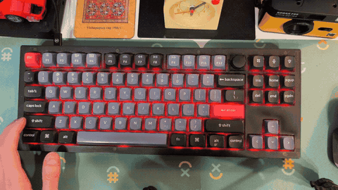

# kolor-keyboard: Индикация раскладки через RGB

Утилита на Go для индикации раскладки клавиатуры через RGB подсветку.

<p align="center">
  
  
</p>
<p align="center">
  <b>Mono</b> — глобальный цвет &nbsp;&nbsp;&nbsp;&nbsp;&nbsp;&nbsp;&nbsp;&nbsp;
  <b>Draw</b> — per-key RGB (флаги, рисунки)
</p>

> ⚠️ **Дисклеймер**
>
> Этот проект полностью сгенерирован с помощью [Claude Code](https://claude.com/claude-code).
> Использование на свой страх и риск. Автор проекта не несёт ответственности за любые
> последствия, включая возможные проблемы с вашим аппаратным или программным обеспечением.

## Поддерживаемые клавиатуры

| Клавиатура | Раскладка | Энкодер | Статус |
|------------|-----------|---------|--------|
| Keychron V3 | ANSI | ✅ | Протестировано |

## Поддерживаемые платформы

| ОС | DE | Статус |
|----|-----|--------|
| Linux | KDE Plasma 6 | Протестировано (openSUSE Tumbleweed) |
| Linux | KDE Plasma 5 | Должно работать |
| Linux | GNOME, Sway и др. | Не поддерживается (планируется) |

## Поддерживаемые прошивки

| Прошивка | Режим Mono | Режим Draw |
|----------|------------|------------|
| **Stock** (QMK/VIA) | ✅ | ❌ |
| **Vial** | ✅ | ✅ |

### Режимы работы:
- **Mono** — глобальный цвет для всей клавиатуры
- **Draw** — per-key RGB для отрисовки флагов стран (только Vial)

---

## Быстрый старт

### 1. Сборка

```bash
git clone https://github.com/jidckii/kolor-keyboard.git
cd kolor-keyboard
make build
```

### 2. Генерация конфигурации для вашей клавиатуры

```bash
./kolor-keyboard discover
```

Команда `discover` автоматически:
- Найдёт подключённые VIA/Vial клавиатуры
- Определит поддержку Vial и количество LED
- Предложит интерактивный маппинг LED по рядам (для draw режима)
- Сгенерирует конфигурационные файлы

### 3. Запуск

```bash
# С конфигом из keyboards/
./kolor-keyboard run -c keyboards/keychron/v3/ansi_encoder/vial_draw.yaml

# Или скопируйте конфиг в стандартное место
cp keyboards/keychron/v3/ansi_encoder/vial_draw.yaml ~/.config/kolor-keyboard/config.yaml
./kolor-keyboard run
```

---

## Команда discover

Команда `discover` — самый простой способ настроить kolor-keyboard для новой клавиатуры.

### Использование

```bash
# Генерация в текущую директорию (keyboards/<vendor>/<model>/<variant>/)
./kolor-keyboard discover

# Генерация в глобальный конфиг (~/.config/kolor-keyboard/)
./kolor-keyboard discover --global

# Указать output директорию
./kolor-keyboard discover -o /path/to/output
```

### Что генерируется

При запуске без `--global` создаются три файла:

```
keyboards/<vendor>/<model>/<variant>/
├── stock_mono.yaml   # Stock QMK/VIA прошивка, mono режим
├── vial_mono.yaml    # Vial прошивка, mono режим
└── vial_draw.yaml    # Vial прошивка, draw режим (если сделан LED маппинг)
```

### LED Mapping Tour

Если клавиатура поддерживает Vial, discover предложит интерактивный маппинг LED:

```
╔══════════════════════════════════════════════════════════════╗
║              LED Mapping Tour                                ║
╠══════════════════════════════════════════════════════════════╣
║  Detected 87 LEDs (indices 0-86)
║                                                              ║
║  Commands:                                                   ║
║    Enter/n  - next LED (add to current row)                  ║
║    r        - end row here (add LED and start new row)       ║
║    s        - skip this LED (don't add to any row)           ║
║    b        - go back (undo last LED)                        ║
║    q        - quit and save                                  ║
║                                                              ║
║  Colors:                                                     ║
║    RED     - current LED                                     ║
║    GREEN   - current row LEDs                                ║
║    YELLOW  - saved rows (different shades per row)           ║
╚══════════════════════════════════════════════════════════════╝
```

Процесс:
1. Текущий LED подсвечивается **красным**
2. Нажимайте `Enter` чтобы добавить LED в текущий ряд (LED станет **зелёным**)
3. На последней кнопке ряда нажмите `r` и затем `Enter` — ряд сохранится (**жёлтый**), начнётся новый
4. `s` — пропустить LED (например, энкодер или индикатор)
5. `b` — вернуться назад
6. `q` — завершить и сохранить
7. По достижении последней кнопки, просто нажмите `Enter`, конфигурация автоматически сохранится и работа discover завершится.

---

## Команды

```bash
# Показать справку
./kolor-keyboard --help

# Запустить демон
./kolor-keyboard run -c config.yaml
./kolor-keyboard run --debug -c config.yaml

# Обнаружение клавиатуры
./kolor-keyboard discover
./kolor-keyboard discover --global

# Управление systemd user service
./kolor-keyboard service install    # Установить и запустить
./kolor-keyboard service uninstall  # Остановить и удалить
./kolor-keyboard service start      # Запустить
./kolor-keyboard service stop       # Остановить
./kolor-keyboard service restart    # Перезапустить
./kolor-keyboard service status     # Показать статус

# Показать версию
./kolor-keyboard version
```

### Поиск конфигурации

Команда `run` ищет конфиг в следующем порядке:
1. Путь указанный через `-c/--config`
2. `~/.config/kolor-keyboard/config.yaml`

---

## Конфигурация

### Формат цвета

Поддерживаются два формата:

```yaml
# RGB (0-255)
color: {rgb: {r: 255, g: 0, b: 0}}

# HSV (0-255, как в QMK/Vial)
color: {hsv: {h: 0, s: 255, v: 255}}
```

### Глобальные настройки

```yaml
brightness: 200  # 0-255, яркость подсветки
```

### Автоопределение устройства

По умолчанию `device` и `firmware` **не обязательны** — программа автоматически найдёт первую подключённую VIA/Vial клавиатуру и определит тип прошивки:

```yaml
# Минимальный конфиг — устройство определится автоматически
mode: draw
brightness: 200

keyboard:
  rows:
    - [0, 1, 2, 3, 4, 5, 6, 7, 8, 9, 10, 11, 12, 13, 14, 15]
    # ...

draw:
  - layout: ru
    stripes:
      - rows: [0, 1, 2, 3, 4, 5]
        color: {rgb: {r: 255, g: 0, b: 0}}
```

### Несколько клавиатур

Если подключено несколько VIA/Vial клавиатур, нужно явно указать `device` для каждой:

```yaml
# ~/.config/kolor-keyboard/keyboard1.yaml
device:
  vendor_id: 0x3434
  product_id: 0x0331

mode: draw
# ...
```

```yaml
# ~/.config/kolor-keyboard/keyboard2.yaml
device:
  vendor_id: 0x3434
  product_id: 0x0320

mode: mono
# ...
```

Запуск нескольких экземпляров:

```bash
# Вручную
kolor-keyboard run -c ~/.config/kolor-keyboard/keyboard1.yaml &
kolor-keyboard run -c ~/.config/kolor-keyboard/keyboard2.yaml &

# Или создать отдельные systemd user services
# ~/.config/systemd/user/kolor-keyboard@.service
```

Пример шаблона systemd для нескольких клавиатур:

```ini
# ~/.config/systemd/user/kolor-keyboard@.service
[Unit]
Description=Kolor Keyboard - %i
After=graphical-session.target

[Service]
Type=simple
ExecStart=/home/user/.local/bin/kolor-keyboard run -c /home/user/.config/kolor-keyboard/%i.yaml
Restart=on-failure

[Install]
WantedBy=default.target
```

```bash
# Использование
systemctl --user enable --now kolor-keyboard@keyboard1
systemctl --user enable --now kolor-keyboard@keyboard2
```

### Как узнать VID/PID клавиатуры

```bash
# Через discover
kolor-keyboard discover

# Или через lsusb
lsusb | grep -i keyboard

# Или через системные утилиты
cat /sys/class/hidraw/hidraw*/device/uevent | grep -E "HID_NAME|HID_ID"
```

### Режим Mono

```yaml
# device: опционально, см. раздел "Несколько клавиатур"
# firmware: опционально, автоопределяется (stock или vial)

mode: mono
brightness: 200

colors:
  - layout: ru
    color: {rgb: {r: 255, g: 0, b: 0}}    # Красный
  - layout: us
    color: {rgb: {r: 0, g: 100, b: 255}}  # Синий
  - layout: "*"
    color: {rgb: {r: 0, g: 255, b: 0}}    # Fallback
```

### Режим Draw (per-key RGB)

```yaml
firmware: vial
mode: draw

brightness: 200

keyboard:
  rows:
    - [0, 1, 2, 3, 4, 5, 6, 7, 8, 9, 10, 11, 12, 13, 14, 15]     # Row 0
    - [16, 17, 18, 19, 20, 21, 22, 23, 24, 25, 26, 27, 28, ...]  # Row 1
    # ...

draw:
  # Флаг России: триколор
  - layout: ru
    stripes:
      - rows: [0, 1]
        color: {rgb: {r: 255, g: 255, b: 255}}  # Белый
      - rows: [2, 3]
        color: {rgb: {r: 0, g: 50, b: 255}}     # Синий
      - rows: [4, 5]
        color: {rgb: {r: 255, g: 0, b: 0}}      # Красный

  # Английская раскладка: синий mono
  - layout: us
    stripes:
      - rows: [0, 1, 2, 3, 4, 5]
        color: {rgb: {r: 0, g: 100, b: 255}}
```

---

## Структура проекта

```
kolor-keyboard/
├── cmd/kolor-keyboard/
│   ├── main.go                    # Точка входа
│   └── cmd/                       # Cobra команды
│       ├── root.go
│       ├── run.go
│       ├── discover.go
│       ├── service.go             # Управление systemd service
│       └── version.go
├── pkg/
│   ├── app/app.go                 # Главное приложение
│   ├── config/                    # Загрузка и валидация конфига
│   ├── dbus/keyboard.go           # KDE D-Bus watcher
│   ├── hid/                       # HID устройство и протокол
│   └── discover/                  # Обнаружение клавиатур
├── keyboards/                     # Конфиги для известных клавиатур
│   └── keychron/v3/ansi_encoder/
│       ├── stock_mono.yaml
│       ├── vial_mono.yaml
│       └── vial_draw.yaml
├── examples/                      # Примеры конфигов
├── Makefile
└── README.md
```

---

## Установка

### Из пакетного менеджера

**Arch Linux (AUR):**
```bash
yay -S kolor-keyboard-bin
```

Или из репозитория Codeberg:
```bash
# Добавить репозиторий (один раз)
echo '[kolor-keyboard]
Server = https://codeberg.org/api/packages/jidckii/arch/$arch' | sudo tee -a /etc/pacman.conf
sudo pacman -Sy kolor-keyboard
```

**Debian/Ubuntu (.deb):**
```bash
# Скачать и установить
curl -LO "https://codeberg.org/api/packages/jidckii/debian/pool/kolor-keyboard/kolor-keyboard_VERSION_amd64.deb"
sudo dpkg -i kolor-keyboard_VERSION_amd64.deb
```

Или настроить репозиторий — см. [инструкцию](https://codeberg.org/jidckii/-/packages/debian/kolor-keyboard).

**Fedora/openSUSE/RHEL (.rpm):**
```bash
# Скачать и установить
curl -LO "https://codeberg.org/api/packages/jidckii/rpm/pool/kolor-keyboard-VERSION.x86_64.rpm"
sudo rpm -i kolor-keyboard-VERSION.x86_64.rpm
```

Или настроить репозиторий — см. [инструкцию](https://codeberg.org/jidckii/-/packages/rpm/kolor-keyboard).

**ALT Linux:**

См. [инструкцию по установке](https://codeberg.org/jidckii/-/packages/alt/kolor-keyboard).

---

### Из исходников

```bash
make install
make enable
```

Это:
- Соберёт бинарник
- Установит в `~/.local/bin/`
- Скопирует пример конфига в `~/.config/kolor-keyboard/`
- Установит и запустит systemd user service

### Ручная установка

```bash
# Сборка
make build

# Копирование
sudo cp kolor-keyboard /usr/local/bin/

# Конфигурация (выберите подходящий конфиг)
mkdir -p ~/.config/kolor-keyboard
cp keyboards/keychron/v3/ansi_encoder/vial_draw.yaml ~/.config/kolor-keyboard/config.yaml

# Systemd service
cp scripts/kolor-keyboard.service ~/.config/systemd/user/
systemctl --user daemon-reload
systemctl --user enable --now kolor-keyboard
```

### udev правила

Для доступа к HID устройствам без root:

```bash
make install-udev
```

---

## Зависимости

- `github.com/godbus/dbus/v5` — D-Bus для KDE
- `github.com/sstallion/go-hid` — HID устройства (требует CGO)
- `github.com/spf13/cobra` — CLI
- `gopkg.in/yaml.v3` — конфигурация

### Для сборки

```bash
# openSUSE
sudo zypper install systemd-devel

# Debian/Ubuntu
sudo apt install libudev-dev
```

---

## Известные ограничения

1. **Per-key RGB требует прошивку Vial** — стоковая прошивка поддерживает только глобальный цвет
2. **Только прямое подключение** — через USB-хаб может не работать
3. **Только KDE Plasma** — используется KDE D-Bus API

## Лицензия

MIT License. См. файл [LICENSE](LICENSE).
